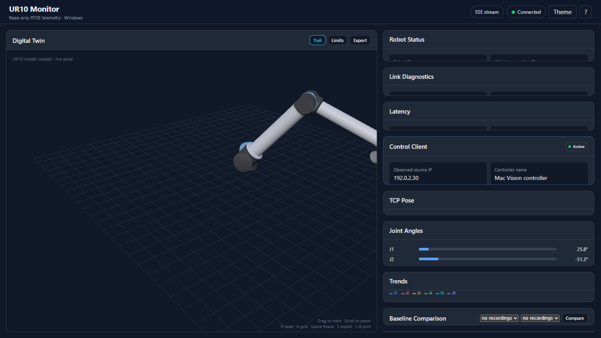

# UR10——MonitorUsingPython

[English](README.md) | [廣東話](README.zh-HK.md) | [繁體中文](README.zh-Hant.md) | **简体中文**

[](https://github.com/oomm2/UR10--MonitorUsingPython/actions/workflows/ci.yml)
[](LICENSE)


适用于 Windows 的 UR10 RTDE 只读遥测监控器。

以下所有 `192.0.2.x` 地址仅为文档示例，并非实际部署地址。
Mac Vision 程序仍然是唯一的控制器：本应用程序只使用 RTDE **纯输出** recipe，绝不发送 URScript、运动指令或 RTDE 输入寄存器。

本项目刻意保持只读设计——整个仓库内没有任何输入 recipe、URScript 或运动指令。


_仪表板：实时 SSE 遥测、UR10 数字孪生与趋势图（合成演示数据）。_

## 架构

```text
Mac: Vision hand tracking  ──(your control path)──>  URSim / UR controller
Windows: this monitor       ──(RTDE outputs only)──> URSim / UR controller
VirtualBox: Bridged Adapter; URSim IP = 192.0.2.10
```

监控器可以与 Mac 控制端同时运行，因为它只订阅遥测数据。

## 安装（Windows PowerShell）

```powershell
cd path\to\UR10--MonitorUsingPython
Copy-Item config.example.json config.json
# 启动服务器前，先为你的机器人与监控器编辑 config.json。
py -m venv .venv
.\.venv\Scripts\python.exe -m pip install --upgrade pip
.\.venv\Scripts\python.exe -m pip install -r requirements.txt
```

RTDE 依赖包为 Universal Robots 官方的 `RTDE_Python_Client_Library`，并锁定到已知上游 commit，以确保安装可复现。

浏览器仪表板使用锁定版本的本地 Three.js 与 `urdf-loader` 副本；加载 3D 视图无需连接互联网。

示例配置默认将 HTTP 绑定到 loopback。如需在可信局域网上接收 heartbeat，请为自己的网络明确设置 `http_host` 与 `monitor_advertised_ip`。切勿将此服务器暴露到互联网。

### 可选的 heartbeat 验证

将 `.env.example` 复制为 `.env`，并按其中说明生成新的私密 token，然后在控制端设置相同的 token。切勿 commit `.env`，也不要在实际部署中使用测试 token。未设置 token 时，需要验证的写入端点保持禁用；只读遥测仍然可用。

开发检查（请先由示例创建本地 `config.json`）：

```powershell
# Python 单元测试（不会打开机器人连接）
.\.venv\Scripts\python.exe -m unittest discover -s tests -v

# Lint 与类型检查
.\.venv\Scripts\python.exe -m pip install ruff mypy
.\.venv\Scripts\python.exe -m ruff check .
.\.venv\Scripts\python.exe -m mypy

# 浏览器端单元测试（Node 20+；无需 npm install）
node --test "tests/js/*.test.mjs"

# 从 vendor/ 重新生成 UR10 URDF 与网格
.\.venv\Scripts\python.exe tools\build_models.py

# 端到端冒烟测试：在一次性端口启动服务器并测试所有端点。
# 不会打开 RTDE 连接，也不会接触机器人。
.\.venv\Scripts\python.exe tools\smoke_test.py
```

## 运行

1. 在 VirtualBox 以 **Bridged Adapter** 启动 URSim，并将 `config.json` 中的 `robot_ip` 设置为其实际地址。
2. 测试 RTDE 端口：

   ```powershell
   Test-NetConnection <ROBOT_IP> -Port 30004
   ```

3. 双击 `start_monitor.bat` 启动监控器，或运行：

   ```powershell
   .\.venv\Scripts\python.exe server.py
   ```

4. 在 Chrome/Edge 打开 `http://127.0.0.1:8080`。

## 读取的数据

以下每个字段都是**纯输出**。绝不发送任何输入寄存器、URScript 调用或运动指令。

| 字段 | 说明 |
|---|---|
| `timestamp` | 控制器时钟，用作实时遥测的判断依据 |
| `actual_q` | 六个实际关节角度 |
| `actual_TCP_pose` | TCP 位置与位姿 |
| `actual_TCP_speed` | TCP 速度；会另行计算线速度与角速度大小 |
| `actual_joint_current` | 每个关节的电流（安培） |
| `joint_temperatures` | 每个关节的温度（°C）；仪表板在 60 °C 时预警、70 °C 时标记为危险 |
| `robot_mode` | 按状态以不同颜色显示 |
| `safety_mode` | 按严重程度以不同颜色显示 |
| `speed_scaling` | 已编程速度的百分比 |
| `actual_digital_input_bits` | 以十六进制掩码显示 |
| `actual_digital_output_bits` | 以十六进制掩码显示 |

数字孪生使用 Universal Robots 官方的 UR10 视觉 DAE 网格与扁平化 URDF（`static/ur10.urdf`）。本地 URDF 加载器应用真实的 UR10 连杆／关节原点，模型会跟随六个实时关节数值，且不会对测量位姿做钳制。关节进度条采用 `static/joint_limits.json` 的标称 ROS 规划范围；J3 的 ±180° 范围仅是规划／显示提示，并非控制器安全限制。超出标称范围的数值仍会显示，并以琥珀色标记。

## 仪表板行为

- **实时流优先。** 仪表板订阅 `GET /api/stream`，一个以 `event_stream_frequency`（默认 10 Hz）发布的 Server-Sent Events 流。若 `EventSource` 不可用或流中断，会自动改用 `GET /api/state` 轮询，并在 Events 日志中说明。
- **趋势图。** 关节角度、工具速度与关节电流会在浏览器内以有上限的 600 点窗口绘制。数据不会上传，重新加载后缓冲区即清空。
- **3D 快捷键。** 点击 3D 视图后，`R` 重置相机、`G` 切换参考网格。
- **录制。** 仪表板可将遥测数据直接流式写入监控主机上的 CSV 文件。详见下文。
- **冻结。** `Space` 会暂停所有面板，方便阅读某个瞬间的数值。流会在后台继续运行；启用时标题栏会显示 `FROZEN` 标签。
- **跳变警示。** 若任一关节在两个采样之间移动超过 `25°`，该关节会在 Joints 卡片标红并显示横幅。由于监控器是只读的，它只能_上报_跳变，无法阻止。
- **飞行记录器。** 最后约 20 000 个 TCP 点会保存在主机的环形缓冲区，并绘制成 3D 轨迹。`GET /api/trajectory` 可获取数据，`POST /api/trajectory/clear`（需 token）可清空缓冲区。
- **重放。** 按 `P` 可以 0.25×–4× 速度前后拖动查看已记录的轨迹，机器人模型上会显示移动标记。
- **关节限制环。** `L` 可切换每个关节的限制环；当关节离开其标称规划范围时会变为琥珀色。
- **延迟。** 当 Mac 控制端的 heartbeat 含有 `sent_at` 字段时，Link Diagnostics 卡片会显示发送到接收的延迟。详见下文_延迟_。
- **基线比较。** 已完成的录制可加载为基线；图表会在共享时间轴上同时绘制基线与实时曲线。
- **主题。** 开关可在深色与浅色配色间切换，并将选择记在 `localStorage`。
- **快照／报告。** `C` 可导出当前视图。详见下文_快照与报告_。
- **帮助。** `?` 打开键盘快捷键卡片；所有快捷键都列在那里。

### 键盘快捷键

| 按键 | 功能 |
|---|---|
| `Space` | 冻结／恢复所有面板 |
| `S` | 切换 3D 轨迹 |
| `1`–`6` | 高亮单个关节 |
| `L` | 切换关节限制环 |
| `J` | 切换跳变警示 |
| `P` | 播放／暂停重放 |
| `C` | 导出快照或报告 |
| `T` | 切换主题 |
| `R` | 重置 3D 相机 |
| `G` | 切换参考网格 |
| `?` | 显示或隐藏快捷键卡片 |

## 延迟

Link Diagnostics 卡片测量 heartbeat 从发送到到达所需的时间。可通过 `latency_mode` 选择两种模式：

| 模式 | 测量内容 | 前提条件 |
|---|---|---|
| `monotonic`（默认） | 使用同一时钟的发送到接收时间，在单一主机上最为可靠 | 发送方在 heartbeat 内容中加入 `sent_at`（秒，源自单调时钟） |
| `clock_sync` | 使用墙上时钟测量 Mac → Windows 的完整路径 | 两台机器必须完成 NTP 时间同步；漂移值会与数据一并上报 |

超出 `0 s – 60 s` 的样本会视为时钟噪声而丢弃，并计入 `rejected`。`GET /api/latency` 会返回 `last_ms`、`mean_ms`、`p95_ms`、`min_ms`、`max_ms`、`samples`、`rejected` 与当前 `mode`。

## 诊断

`GET /api/diagnostics` 上报监控器运行期间收集的连接健康状况：收到的总样本数、连接次数、重连次数、最后一次断线原因、订阅者数量与丢弃的 SSE 帧数。这些是只读统计——不会写回控制器。

## 快照与报告

`C`（或 Snapshot 按钮）可将 3D 视图导出为 PNG。若正在录制，同一操作亦可生成独立的 HTML 报告，内含实时数值、近期趋势表与渲染的 3D 图像。两种文件都在浏览器下载；不会上传任何数据。

## HTTP API

| 方法 | 路径 | 验证 | 用途 |
|---|---|---|---|
| `GET` | `/api/state` | 无 | 完整遥测快照（状态、延迟、轨迹状态、订阅者） |
| `GET` | `/api/stream` | 无 | Server-Sent Events 遥测流 |
| `GET` | `/api/config` | 无 | 非机密配置 |
| `GET` | `/api/trajectory` | 无 | 飞行记录器数据点 |
| `POST` | `/api/trajectory/clear` | token | 清空飞行记录器 |
| `GET` | `/api/latency` | 无 | 延迟统计 |
| `GET` | `/api/diagnostics` | 无 | 连接与订阅者计数 |
| `GET` | `/api/baseline` | 无 | 供比较用的基线时间轴 |
| `POST` | `/api/control/heartbeat` | token | 控制端 heartbeat（同时携带结构化遥测） |
| `GET` | `/api/recording` | 无 | 录制状态、时长与文件列表 |
| `POST` | `/api/recording/start` | token | 开始 CSV 录制 |
| `POST` | `/api/recording/stop` | token | 停止当前录制 |
| `GET` | `/api/recording/download/<name>` | 无 | 从 `recording_directory` 下载 `.csv` |

需要 token 的端点会从 `X-Heartbeat-Token` 读取共享密钥。

## 将遥测录制为 CSV

录制在启动前保持关闭，而且只写入监控主机——绝不会写入机器人。

```powershell
# 开始（需要 heartbeat token）
curl.exe -X POST http://127.0.0.1:8080/api/recording/start `
  -H "X-Heartbeat-Token: $env:UR_MONITOR_HEARTBEAT_TOKEN"

# 查看状态、时长与行数
curl.exe http://127.0.0.1:8080/api/recording

# 停止
curl.exe -X POST http://127.0.0.1:8080/api/recording/stop `
  -H "X-Heartbeat-Token: $env:UR_MONITOR_HEARTBEAT_TOKEN"
```

文件会存入 `recording_directory`（默认 `recordings/`），并可通过 `GET /api/recording/download/<name>.csv` 下载。只有该目录内的纯 `.csv` 文件名可解析；其他任何路径都返回 404。

录制会在 `recording_max_seconds`（默认 3600）后自动停止，并上报 `auto_stopped: true`。CSV 表头固定不变，记录于 `recording.py` 的 `RECORDING_COLUMNS`。

> 录制与 heartbeat 端点使用同一组密钥，因为它会在主机上写入文件。它绝不会接触机器人。

## 文件

- `server.py` — HTTP 处理器与程序入口；负责串联以下模块
- `monitor_config.py` — `config.json` / `.env` 的加载、验证与缓存
- `telemetry_state.py` — 共享状态存储、飞行记录器轨迹缓冲与延迟跟踪
- `rtde_client.py` — 纯输出 RTDE 读取线程与重连循环
- `events.py` — Server-Sent Events 代理与状态发布器
- `recording.py` — CSV 录制会话与固定字段集
- `controller.py` — Mac 控制端 heartbeat 存储、限流与结构化遥测
- `monitor.xml` — 纯输出 RTDE recipe
- `static/index.html` — 仪表板外壳与样式（深色与浅色主题）
- `static/app.js` — 遥测仪表板、图表、验证、冻结、重放、快捷键与导出
- `static/scene.js` — 本地 Three.js / URDF 数字孪生，含轨迹、限制环、相机快捷键与图像捕获
- `static/telemetry.js` — 可测试的轮询、SSE 客户端、状态验证、历史、图表与轨迹辅助函数
- `static/replay.js` — 轨迹重放的时间轴拖动器
- `static/theme.js` — 仪表板共享的主题控制器
- `static/vendor/` — 锁定版本的本地 Three.js 与 URDF 加载器模块（含许可证）
- `static/ur10.urdf` — 浏览器使用的扁平化 UR10 运动链
- `static/joint_limits.json` — 六个关节的标称进度条范围
- `static/meshes/ur10/` — 官方 UR10 视觉网格
- `config.example.json` — 公开配置模板；复制为被忽略的 `config.json` 作本地配置
- `.env` — 本地 heartbeat 密钥（被忽略；请复制 `.env.example`）
- `start_monitor.bat` — 一键启动器
- `tests/` — Python 单元测试
- `tests/js/` — 浏览器模块单元测试（Node 内建运行器）
- `tools/build_models.py` — 从 `vendor/` 重新生成 `static/ur10.urdf` 与网格
- `tools/smoke_test.py` — 针对一次性服务器的端到端 HTTP 冒烟测试
- `pyproject.toml` — ruff 与 mypy 配置

## 机器人模型

数字孪生渲染的是 **UR10**。`config.json` 中的 `robot_model` 只接受 `UR10`，与本项目监控的机械臂一致。运行一次 `tools/build_models.py` 即可从 `vendor/Universal_Robots_ROS2_Description`（重新）生成 `static/ur10.urdf` 与 `static/meshes/ur10/`。

日后若要支持其他机型，请在 `tools/build_models.py` 的 `MODELS` 加入其 `urXY` -> `URXY` 条目，并在 `monitor_config._validate_config` 的允许列表加入相同名称，然后重新运行脚本——脚本也会清除已移除机型残留的 URDF 或网格文件夹。本发布版本仅包含 UR10 的构建输入。支持其他机型需要另行获取并审查其上游文件与适用许可证。

## 配置

所有配置值都存于 `config.json`，加载时会验证。若编辑后格式错误，系统会继续使用最后一次正确的配置并记录警告；首次加载则必须有效。

| 键 | 默认值 | 含义 |
|---|---|---|
| `robot_ip` | `192.0.2.10` | URSim / 控制器地址 |
| `rtde_port` | `30004` | RTDE 端口 |
| `rtde_frequency` | `25.0` | 输出 recipe 频率（Hz） |
| `http_host` | `127.0.0.1` | 安全的本地默认值；仅在可信网络上明确启用局域网绑定 |
| `http_port` | `8080` | HTTP 端口 |
| `monitor_advertised_ip` | `192.0.2.20` | 显示给 Mac 的地址；留空表示“由路由推导” |
| `controller_heartbeat_timeout` | `4.0` | heartbeat 视为过期前的秒数 |
| `cors_allowed_origins` | `[]` | 额外的精确浏览器来源；拒绝通配符 |
| `heartbeat_max_failures` | `5` | 单一 IP 在锁定前允许的 token 失败次数 |
| `heartbeat_lockout_seconds` | `60.0` | 锁定持续时间；`0` 表示禁用锁定 |
| `event_stream_frequency` | `10.0` | SSE 发布频率（Hz） |
| `recording_directory` | `recordings` | CSV 输出的相对目录 |
| `recording_max_seconds` | `3600.0` | 录制长度的硬性上限 |
| `robot_model` | `UR10` | 数字孪生机型。仅构建并接受 `UR10` |
| `latency_mode` | `monotonic` | `monotonic`（单一时钟）或 `clock_sync`（NTP 同步主机） |
| `trajectory_capacity` | `20000` | 飞行记录器环形缓冲区的点数上限 |
| `trajectory_sample_hz` | `25.0` | 轨迹点存储的最大频率 |

## 网络注意事项

若 Windows 主机与 Mac 需要直接连到 URSim VM，请在 VirtualBox 使用 **Bridged Adapter**。监控器直接连接 URSim，并非 Mac Vision 控制器的代理。

若 VM 获得新地址，请编辑 `config.json` 并修改 `robot_ip`。

## 查看当前 Mac 控制端 IP

仪表板有一张 **Control Client** 卡片。当 Mac Vision 控制端每秒向监控器发送一次通过 token 验证的 heartbeat 时，它就能可靠地显示 IP。Windows 会自行记录 HTTP 来源地址，因此显示的 IP 并非应用程序自行提供的值。heartbeat 用于识别发送者进程；并不能证明机器人正在执行运动指令。

- Windows 监控器局域网地址：`192.0.2.20`
- Heartbeat 端点：`http://192.0.2.20:8080/api/control/heartbeat`
- 集成指南：`CONTROLLER_HEARTBEAT.zh-Hans.md`
- 即用型 Mac 辅助程序：`mac_controller_heartbeat.py`
- Heartbeat 密钥：被忽略的 `.env` 或进程环境中的 `UR_MONITOR_HEARTBEAT_TOKEN`——请勿 commit 或泄露。

仅有 RTDE 遥测**无法**列出其他客户端的 IP。若 Mac 应用程序未发送 heartbeat，卡片会刻意显示 `Unknown`，而不是猜测。

示例配置只在本地监听。若要让 Mac 访问 heartbeat API，请明确启用局域网绑定。若 Mac 无法连接，请在 Windows 防火墙为专用网络允许 TCP 8080 入站。

同一来源地址的错误 token 达到 `heartbeat_max_failures` 次后，会返回 `429` 并附带 `Retry-After` 标头。锁定期间即使 token 正确，也必须等待锁定结束。锁定结束后，成功通过验证的请求会清除失败计数。

## 最小化 UR10 模型来源

本发布版本仅包含 `tools/build_models.py` 所需的 UR10 配置与视觉网格输入。不含上游 Git metadata 或其他机型。浏览器在运行时使用 `static/`；请保留最小化的 vendor 输入以供重新生成与测试。两份网格副本均已移除作者工具、贡献者与创建／修改时间等 metadata，但未改变几何、单位或坐标轴。上游许可证文本均已保留。

## 许可与第三方声明

本项目以 [MIT License](LICENSE) 发布。第三方组件保留其自身许可；见 [THIRD_PARTY_NOTICES.md](THIRD_PARTY_NOTICES.md)。

## 安全与部署限制

这是监控辅助工具，不是安全设备。它无法停止或阻止机器人运动。包括遥测与录制下载在内的读取端点均未验证。对非浏览器客户端而言，CORS 并非访问控制边界。请仅在可信网络上使用，并在发布实时录制、截图或报告前，先检查其中是否含部署 metadata。

准备工作检查与未决事项见 [PUBLIC_RELEASE_CHECK.md](PUBLIC_RELEASE_CHECK.md)。
